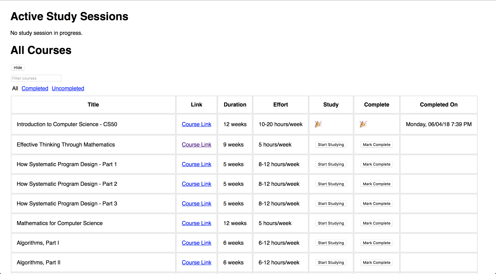

## OSSU study session tracker.

I'm working my way through [OSSU](https://github.com/ossu/computer-science), and I thought it might be interesting to know how long I spent studying on different courses, so I threw this app together. It uses [Elasticsearch](https://www.elastic.co) for data storage, which is completely inappropriate, but it's fun fun.

This project was also bootstrapped with [Create React App](https://github.com/facebookincubator/create-react-app).

It looks like this:

Hit me up if you ever want to run this locally.
